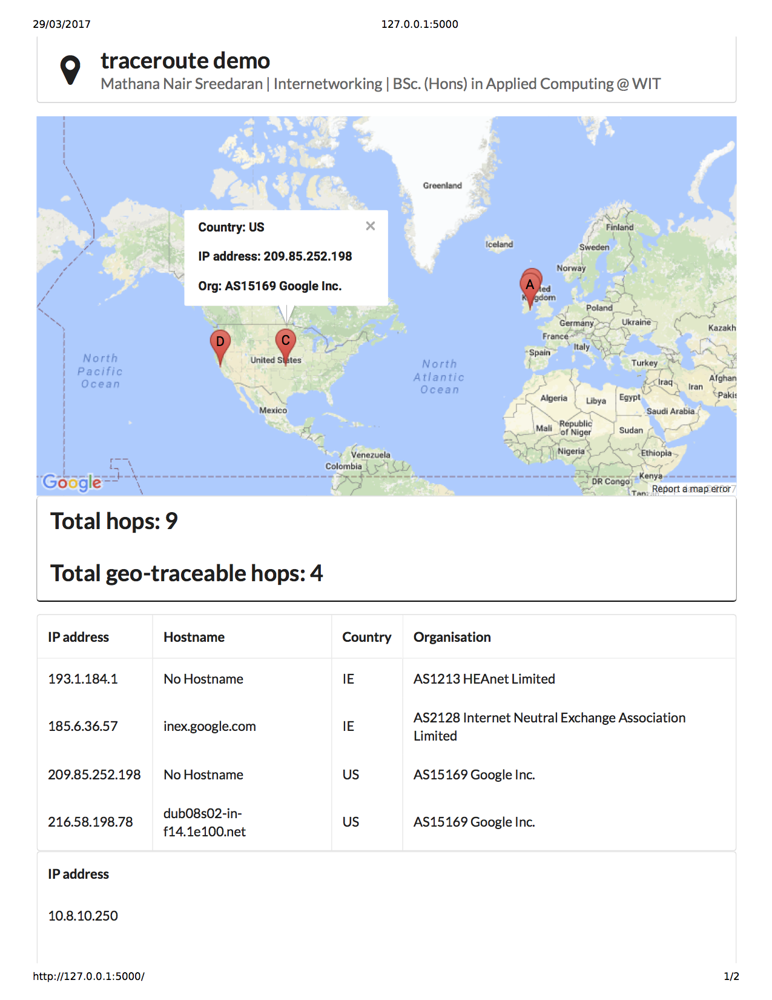
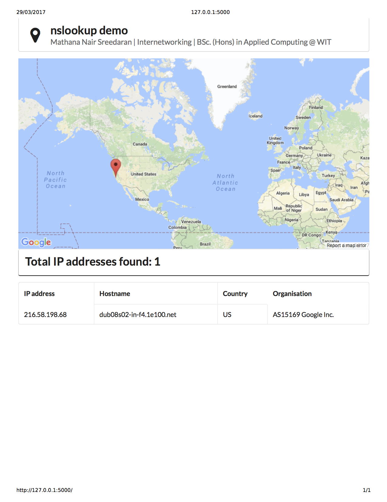

# GUI Implementation of `traceroute` and `nslookup`
A basic application which superimposes the output of `traceroute` and `nslookup` over an interactive map based on their geolocation. 

### Below are the list of technologies used;
* Language: Python
* Framework: Flask with Jinja2
* APIs: Google Maps & ipinfo.io

### Below are screenshots of the outputs;

#### `traceroute`

#### `nslookup`

### Improvements for the future
* A front-end
* Deployment
* Add features/look-and-feel
